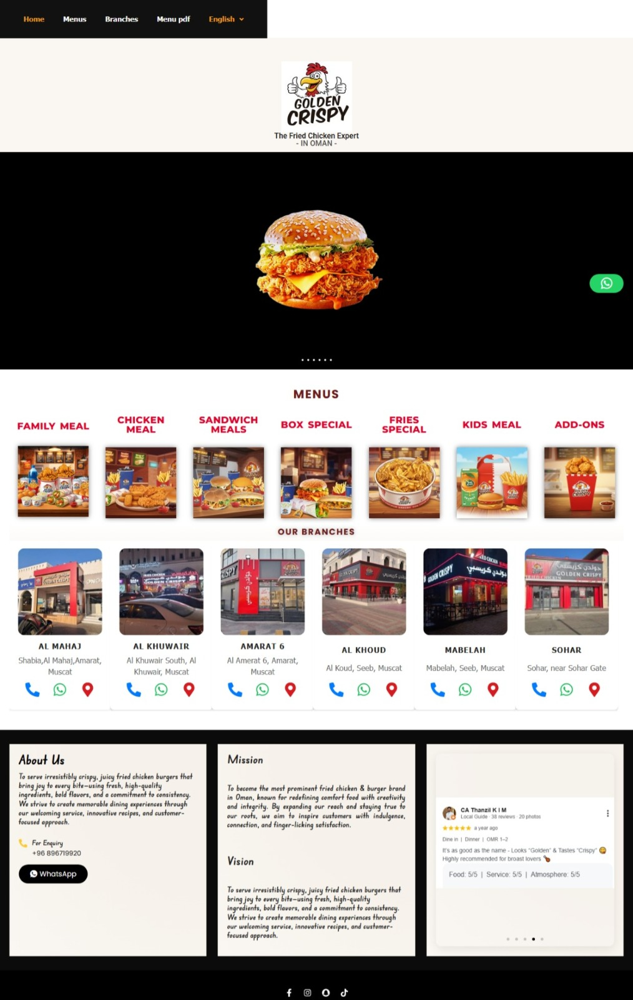

# Golden Crispy Oman Website

A responsive WordPress website developed for a restaurant client in Oman.

## Technologies Used

- WordPress
- Flex Fast Food Theme
- Elementor
- HTML
- CSS
- JavaScript

## My Responsibilities

- Analyzed customer requirements and identified website needs based on business goals.
- Gathered and organized content requirements for branch information and customer communication.
- Created and designed the Branches section to showcase multiple business locations.
- Customized page layouts and visual elements using Elementor.
- Implemented WhatsApp messaging functionality to enable quick customer inquiries.
- Improved the overall website appearance, usability, and user experience.
- Assisted in testing and refining website features based on client feedback.

## Screenshot

### Homepage

## Note

This repository is for portfolio purposes only. Client-specific files, database backups, and credentials are not included.
